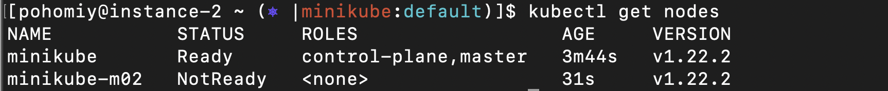

<h2>Lab: containerizing and deploying application into K8S cluster </h2>  

<h3>Fork repo https://github.com/ingvar-goryainov/python-app </h3>  

1. Open web browser. Go to the page https://github.com/ingvar-goryainov/python-app.  
   In upper left corner click "Fork" button then select youre github account from the list.
2. Spin up VM. Update packages , install git. Perform some steps for basic setup of git. 
   Create folder and clone repo:  
 ```  
* sudo apt update && sudo apt upgrade -y  
* sudo apt install git
* git config --global user.name "Vasyl Pohomii"  
* git config --global user.email vpohomii@playtika.com  
* git config --global core.editor vim
* mkdir  w3 ; cd w3  
* git clone https://github.com/vpohomii/python-app.git  
```

<h3>Build docker image with Python application </h3>

1. Performing installation of Docker  
#Install packages to allow apt to use a repository over HTTPS:  
```  
sudo apt-get install -y apt-transport-https \
                        ca-certificates \
                        curl \
                        software-properties-common \
                                jq \
                                conntrack \
```  
#Add Docker’s official GPG key, adding repo, updating packages and install docker:
```  
curl -fsSL https://download.docker.com/linux/ubuntu/gpg | sudo apt-key add - 

sudo add-apt-repository \
           "deb [arch=amd64] https://download.docker.com/linux/ubuntu \
              $(lsb_release -cs) \
                 stable"

sudo apt-get update && sudo apt-get install -y docker-ce  
sudo usermod -aG docker $USER  
```  

#install compose  
```  
  sudo curl -L https://github.com/docker/compose/releases/download/1.19.0/docker-compose-`uname -s`-`uname -m` \ 
  -o /usr/local/bin/docker-compose
  sudo chmod +x /usr/local/bin/docker-compose
```  

2. Create Dockerfile using the Best practices from https://docs.docker.com/develop/develop-images/dockerfile_best-practices/   
   Prepare requirements file:  
```  
grep -A 3 install_requires application/setup.py | egrep "'*'" | sed -e "s/,//g; s/'//g" > application/requirements.txt
```  

```  
* cd python-app  
* touch Dockerfile  
* vim Dockerfile  
```  
# Dockerfile  
```  
  #Stage 1 Choosing image for work
  FROM python:3.8.9-alpine3.13 as prepare
  WORKDIR /usr/src/app
  # Copy application to image
  COPY application/ .
  # installing tools and extracting dependencies to the file
  RUN pip install pip-tools  \
   && python3 -m piptools compile 
  
  # Stage 2. Choosing clean image
  FROM python:3.8.9-alpine3.13 as build
  WORKDIR /usr/src/app
  # Copy requirements.txt and application  file from previous stage
  COPY --from=prepare /usr/src/app/ . 
  # Install dependencies, application, adding non-root user and group, change permissions
  RUN pip install --no-cache-dir -r requirements.txt && python3 setup.py install \
                         && addgroup -g 10001 pyapp \
                         && adduser -D -h /usr/src/app -u 10000  pyapp -G pyapp \ 
                         && chown pyapp:pyapp /usr/src/app  \
                         && chmod 755 /usr/src/app 
  USER pyapp
  EXPOSE 8080
  ENTRYPOINT ["python3","-m"]
  CMD ["demo"]    
```  

Build image  
```  
docker build -t demo:v-0 .
```  

Running image in container 
```  
  docker run -d -p 8080:8080 6d0d7b53f9a6 
```  
And check that its work
```  
curl 0.0.0.0:8080
```  


For better compression using "Docker-Slim minifier" https://github.com/docker-slim/docker-slim
```  
  curl -L -o ds.tar.gz https://downloads.dockerslim.com/releases/1.37.0/dist_linux.tar.gz
  tar -xvf ds.tar.gz
  mv  dist_linux/docker-slim /usr/local/bin/
  mv  dist_linux/docker-slim-sensor /usr/local/bin/
  
  ## move into folder with docker-slim and build slim version of image
  cd /usr/local/bin
  docker-slim build --publish-exposed-ports demo:v-0
```  
Run 'docker images' and make sure that image was created and its size only 20,8 Mb instead original size 58,2.


Running slim container and check that its work
```  
docker run -d -p 8080:8080 a2a717ef9722
docker ps
curl 0.0.0.0:8080
```  


# Docker container logs
 

Tag and push images into registry
```  
docker login 
docker tag 6d0d7b53f9a6 vnp79/demo:v0
docker tag a2a717ef9722 vnp79/demo-slim:v0
docker push vnp79/demo-slim:v0
docker push vnp79/demo:v0
```  

<h3> Setup K8S cluster using Minikube </h3>

1. Update the apt package index and install packages needed to use the Kubernetes apt repository:  

```  
  sudo apt-get update  
  sudo apt-get install -y apt-transport-https ca-certificates curl  
```  

2. Install kubectl  

```  
  curl -LO https://storage.googleapis.com/kubernetes-release/release/v1.18.0/bin/linux/amd64/kubectl  
```  

3. Make the kubectl binary executable 

```  
  chmod +x ./kubectl  
```  

4. Move the binary in to your PATH.  

```  
  sudo mv ./kubectl /usr/bin/kubectl  

  echo "source <(kubectl completion bash)" >> ~/.bashrc  

  curl -Lo minikube https://storage.googleapis.com/minikube/releases/latest/minikube-linux-amd64 \  
    && chmod +x ./minikube  

  sudo usermod -aG docker $USER && newgrp docker
  sudo su - $USER
  sudo ./minikube start  --nodes=2  
```  

5. Give user permissions to kubectl config  
```  
  sudo chown -R $USER $HOME/.kube $HOME/.minikube 
```  

6. Install kube-ps1  

```  
  cd ~/  
  git clone https://github.com/jonmosco/kube-ps1.git  
  echo 'source ~/kube-ps1/kube-ps1.sh' >> ~/.bashrc  
  echo "PS1='[\u@\h \W \$(kube_ps1)]\$ '" >> ~/.bashrc  
  cd -  
```  

7. Install kubens and kubectx  

```  
  git clone https://github.com/ahmetb/kubectx.git ~/.kubectx  
  COMPDIR=/usr/share/bash-completion/completions  
  sudo ln -sf ~/.kubectx/completion/kubens.bash $COMPDIR/kubens  
  sudo ln -sf ~/.kubectx/completion/kubectx.bash $COMPDIR/kubectx  
  cat << FOE >> ~/.bashrc  
```  

8. Kubectx and kubens  
```  
  export PATH=~/.kubectx:\$PATH  
  FOE
```  


```  
 kubectl get nodes
```  

  

<h3> Deploy the application into the K8S cluster </h3>  

1. Creating Deployment .yaml file with containerized application  

```  
kubectl create deployment demo --image=vnp79/demo-slim:v0 --dry-run -oyaml > demo.yaml  
```  


* The deployment requires 3 replicas, “RollingUpdate” strategy. Emulate the “RollingUpdate” strategy by updating docker image. Provide screenshots. Define the liveness and readiness probes to /health endpoint and 8080 port, resources(requests/limits)   

*  Create a “Service” object which exposes Pods with application outside the K8S cluster in order to access each of the replicas through the single IP address/DNS name.  

*  Specify PodDistruptionBudget which defines that only 1 replica can be down.  

